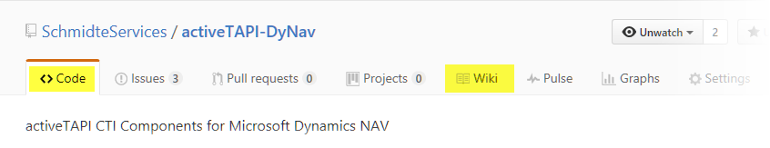

# activeTAPI CTI Components for Microsoft Dynamics NAV

Welcome to activeTAPI on GitHub. 

Here, in the `CODE` section you will find the latest activeTAPI binaries & tools, as well as the NAV Objects. 

* NAV-Objects
* activeTAPI-DyNav

In our `[WIKI]` section you will find the latest tips and information.

## activeTAPI-Components

The activeTAPI-Components are the **binary part and they must be installed on any machine that will connected with Windows-TAPI (CTI)**. The activeTAPI-Components are the bridge between Microsoft Dynamics NAV and Windows-TAPI.

You can download the `activeTAPI-DyNav.msi` file from the `CODE` section

**Note:** Windows-TAPI itself is another bridge between your Windows Machine and the telephony hardware. To make Windows-TAPI work you must have a Windows-TAPI (CTI) driver installed for the telephony hardware you are planning to use. Please refer to your CTI hardware vendor for more information regarding that.

## NAV-Objects

The NAV-Objects are the Microsoft Dynamics NAV part which contains the NAV functionality for CTI. The NAV-Objects connect with activeTAPI and they finally **integrate CTI with Microsoft Dynamics NAV**. The NAV-Objects depend on the NAV Version you are using. 

You can download the NAV Objects for all different Microsoft Dynamics NAV versions using *Download ZIP* button or navigate through the repository to get just the required files.

See also [activeTAPI-Components Web-Site](http://www.activeTAPI.de).

