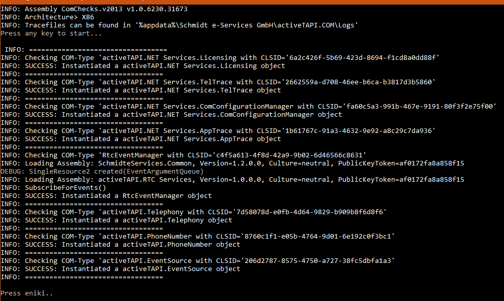
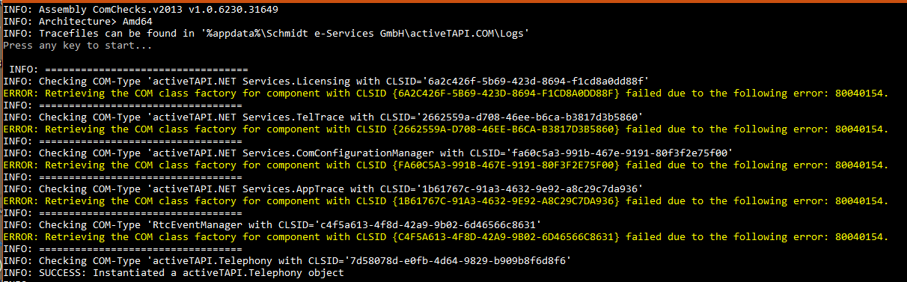
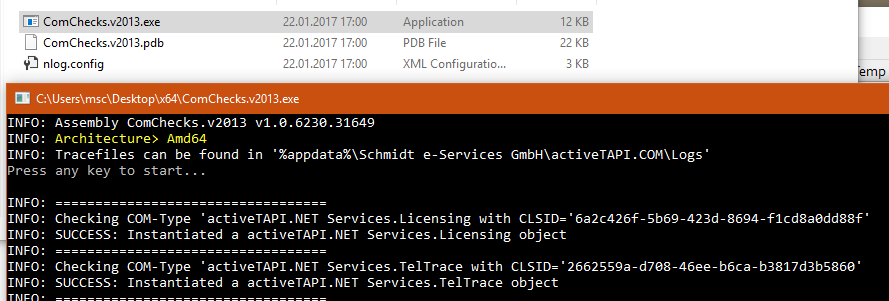
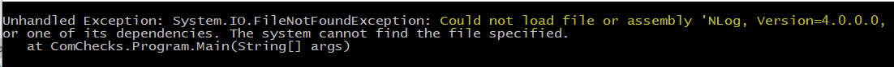
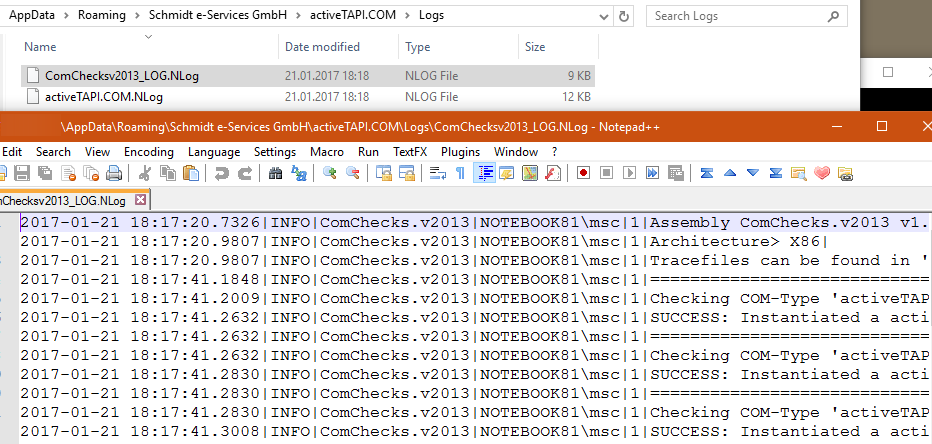

# activeTAPI-DyNav COM-Checks

*ComChecks* is a small application which checks all required COM-Objects are registered and all .NET Components are installed and reachable. 

If, for example, Registry entries are missing, COM-Objects cannot be instantiated properly. If a .NET component cannot be found in its expected location (e.g. GAC), such object creation will fail as well. 

*ComChecks* performs some checks for proper installation of

1) 32-Bit Client application or
2) 64-Bit Client application

## Installation

1. Download [ComChecks.v2017.zip](../ComChecks.v2017.zip) from here 
2. and unzip it to any directory. 

Execute the appropriate `ComCheck.v2017.exe`  (x86 or x64) from a Console window (cmd.exe), depending on the NAV-Client you have planned to use. If everything is ok, you will see a result like this:

All results will be logged to 

`%AppData%\Roaming\Schmidt e-Services GmbH\activeTAPI.COM\Logs`

### x64 Patch required

If you ran the x64-Bit version of *ComChecks* and it failed like this:

you have to apply the x64 patch. Then, try again and verify you don't get these errors anymore. Please notice the `Architecture: Amd64` line which tells you that you are executing *ComChecks* on a x64 bit environment.

### activeTAPI not yet installed

If you encounter a message like this:

which says: NLOG is not installed, you may check if you ran the Setup on this machine.

## Contact Support

In case of any failure, please uninstall and re-install activeTAPI first, before you may send the log files to [msc@activeTAPI.net](mailto:msc@activeTAPI.net) for diagnosis.

