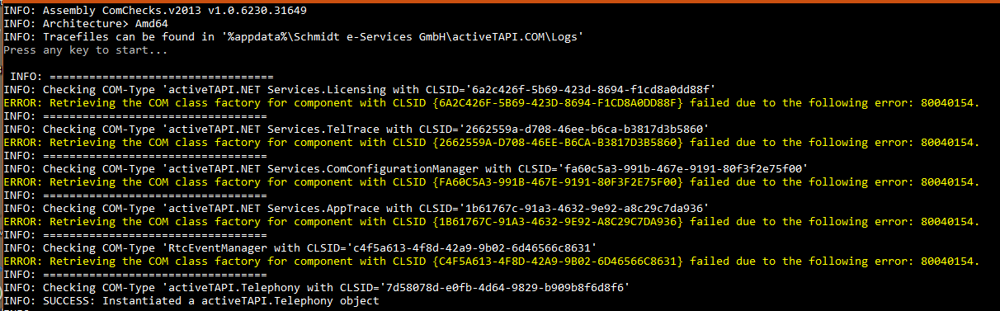
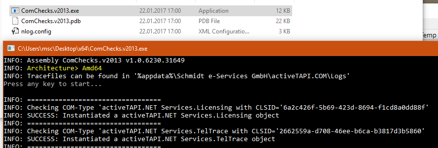

# How to use activeTAPI with the 64-Bit NAV-Client

**This information applies to 64-Bit operating systems only!**

Normally the NAV-Client is a 32-Bit application (x86), started from `Program Files (x86)\` folder. With newer versions of NAV there is also a second client application under `Program Files\` which is actually the 64-Bit version of the NAV client. Of course, this is the case, only for 64-Bit versions of Windows. Depending on which client you start, activeTAPI will be hosted in a 32-Bit or 64-Bit environment.

`activeTAPI-DyNAV v2013.msi` setup is a x86 (32-Bit) setup. Means after installation activeTAPI can be use with a 32-Bit NAV-Client, only. Using activeTAPI from a x64 NAV-Client will fail.

## Fix Setup for 64-Bit Clients

If you are planning to use activeTAPI in a **64-Bit environment, please you need to check & fix activeTAPI setup**, to make this work. There are two steps to fix this.

### Run ComChecks x64

First you should run *ComCheks* in the x64 Bit version to see it will fail. (see also [More information about ComChecks](ComChecks.md), [Download ComChecks](../tools).

### Fix Registry 

Second step is, to download and unzip the [required Registry fixes](../tools/x64RegistryFixes.v2013.zip). Double-click each reg-file to import its information into the Registry (Note: You may need to do this with administrative privilegs. Check with standard privilegs first.).

### Optional second check

Once the fixes are applied, run the ComChecks x64-Bit Client again to verify there are no more errors:

## Important information for NAV 2017

With NAV2017 we have seen, that also the  Client in the `Program Files (x86)\` folder is a 64-Bit application. Even if this is not according to the Microsoft standards, the consequnce is: **there is no longer a 32-Bit Client for NAV 2017**.

