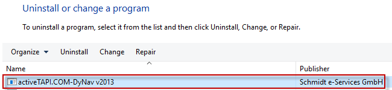

# activeTAPI-DyNav.v2013 - Setup & Tools

Welcome to activeTAPI-DyNav v2013. In this folder you will find the latest setup and tools for activeTAPI-DyNav v2013.

## Setup

Download and install [activeTAPI.COM-DyNav_v2013_Setup.msi]().  

Once this is done, you should first check Windows TAPI is setup correctly. Do this, by using the `SimpleDialer` application from Start-Menu. If you can find the expected Telephone device and if you can use the *SimpleDialer* to dial and if you see inbound telephone numbers, you can continue and install the [NAV-Objects](<https://github.com/SchmidteServices/activeTAPI-DyNav/tree/master/NavObjects>) in you NAV instance. 

## Tools
The are some tools which mainly address the issues with NAV 64-Bit Client. See also [How to use activeTAPI with a 64-Bit Client](doc/x64Client.md)

